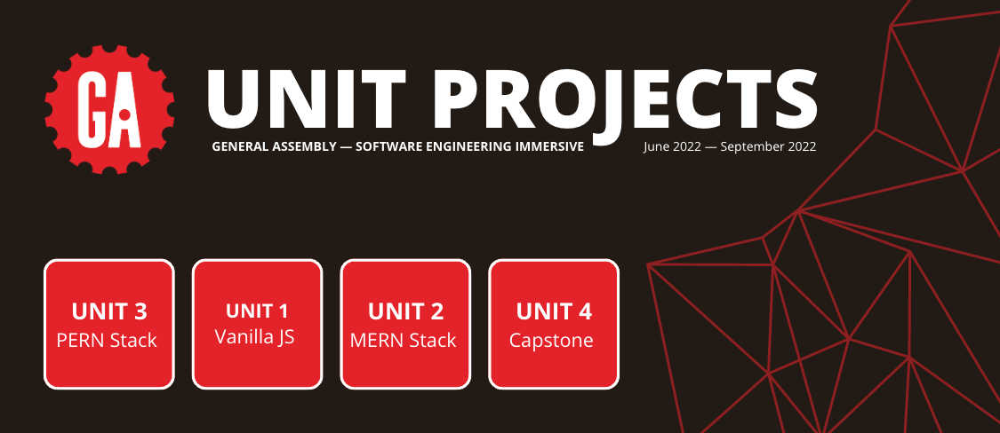

## 

# Unit Projects _General Assembly—Software Engineering Immersive_

## Joshua Langner

##### June 2022 - September 2022

| [LinkedIn](https://www.linkedin.com/in/josh-langner-48) | [GitHub](https://github.com/jlangner87) | [Portfolio](https://joshua-langner.com) |

---

### **_Overview_**

This repo contains the files for the final projects for each of the 4 units we covered during my time at the General Assembly Software Engineering Immersive.

These projects reflect my skill level at the time that the projects were developed. These are some of the first milestones of my career.

---

### **_The Projects_**

##### _Unit 1: Vanilla JS_

Objective: Create a browser game using JavaScript, HTML, and CSS.

##### _Unit 2: MERN Stack_

Objective: Create a dynamic web applicaton using the MERN stack.

##### _Unit 1: PERN Stack_

Objective: Create a dynamic web applicaton using the PERN stack.

##### _Unit 1: Capstone_

Objective: Create a dynamic web application using any combination of previously learned tech + at least one tech not covered in the course.

## _(A detailed README of each project is available in its corresponding directory)_
